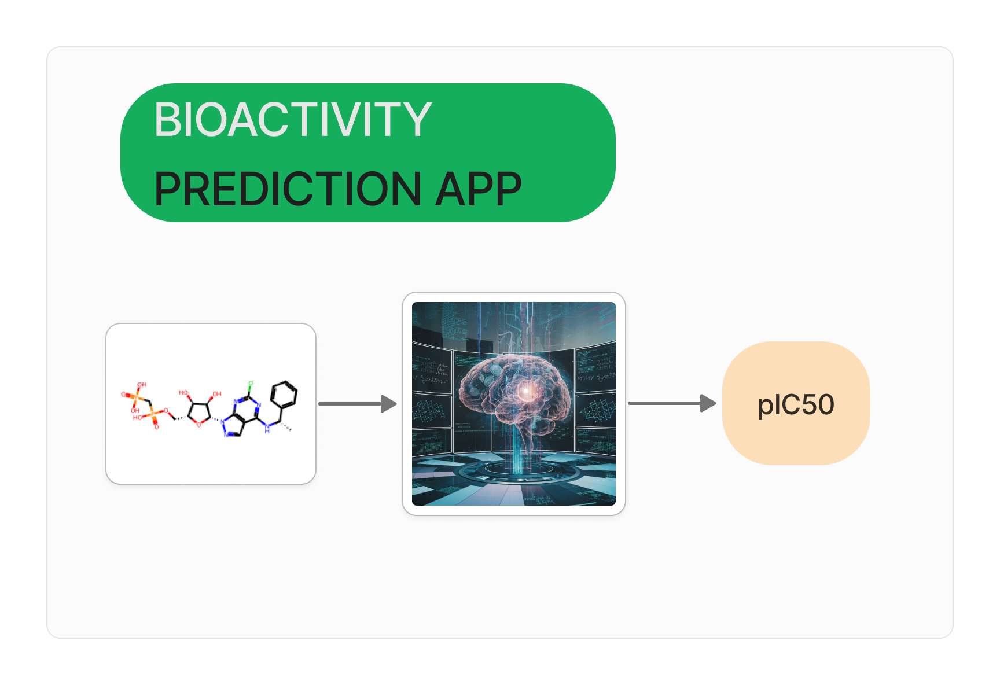

# CD73 Inhibitor Bioactivity Prediction App

Welcome to the CD73 Inhibitor Bioactivity Prediction App! This Streamlit application is designed to predict the bioactivity of CD73 inhibitors using machine learning techniques. The app utilizes a LightGBM regression model trained on molecular data to provide predictions for the pIC50 of potential CD73 inhibitor compounds.

## Overview

The prediction process involves several steps:

1. **Data Retrieval**: The first notebook in this repository is dedicated to retrieving the SMILES notation of molecules. 

2. **Feature Extraction**: After obtaining the SMILES notation, PaDEL-Descriptor is used to extract features necessary for the prediction. Note that Java installation is required for this step.

3. **Model Training and Export**: The second notebook is utilized for training various models and selecting the best one. The chosen model is then exported as a .pkl file along with the descriptor_list.csv, which describes the non low-variance features used for the model and required by the app.

4. **App Usage**: To use the app, ensure you have the descriptor_output.csv containing the features. The app works with a text file where the first column is the SMILES of the molecule and the second column is the name or ID.

## Quick Start

To get started with the CD73 Inhibitor Bioactivity Prediction App:

1. Clone this repository to your local machine.
2. Follow the instructions in the notebooks to retrieve SMILES notation, extract features, train the model, and export necessary files.
3. Ensure you have Java installed for the feature extraction step.
4. Run the Streamlit application using `streamlit run app.py`.
5. Enjoy predicting the bioactivity of CD73 inhibitors!

## Dependencies

- Python 3.x
- Streamlit
- LightGBM (or your best model)
- PaDEL-Descriptor

## Note

Please make sure to cite the appropriate sources if you utilize the models or data provided in this repository for any research or publication.

## Enjoy the Prediction!

Feel free to explore the app and make predictions on potential CD73 inhibitor compounds. If you have any questions or suggestions, don't hesitate to reach out.

Happy predicting! 🧪🔬🚀
